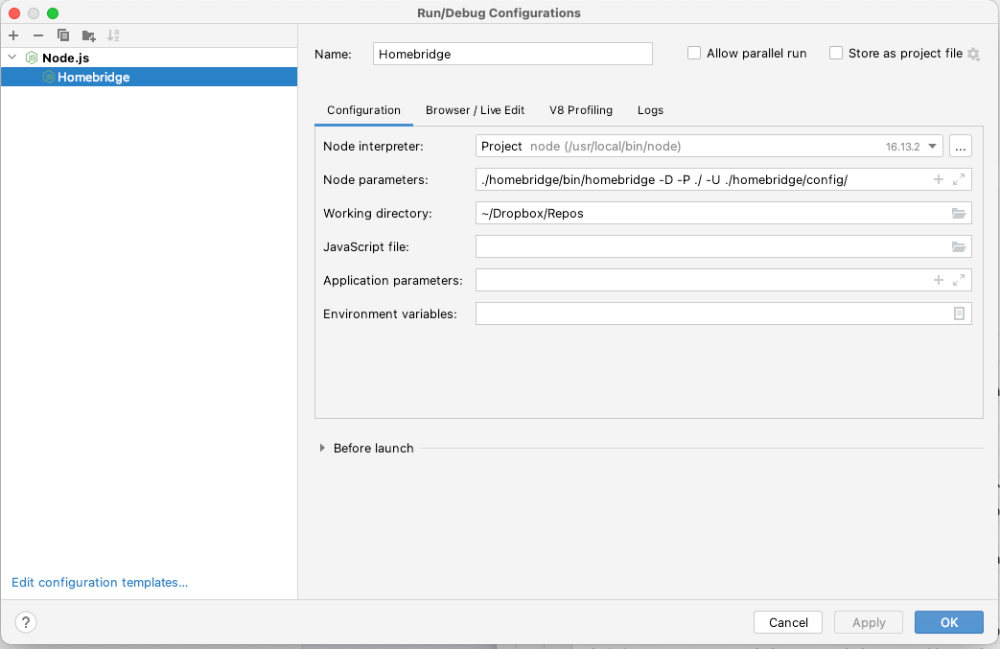

# Homebridge Lutron Homeworks Plugin (Minor edits)

## Edited Intro
This is a very minorly edited plugin that is based on kikolobo's work - I just noticed for my lutron homeworks the commands were slightly different, so some minor tweaking was needed. I'm assuming I'm on an earlier version as its 10+ years old now.

Originally I struggled to access the proccessor info (XML file) - but in my case I was also to login with the credentials (username,password): LutronGUI,jetski.

The server allowed anonymous FTP and I was able to access 'fullxml.dat' - which is actually a zip, so you can just unzip it and then you have access to the XML file.


## Welcome:
This is a HomeBridge plugin to integrate Lutron Homeworks lighting systems to Homekit. This will help control your lights of your lutron system with Apple Homekit.

In the current version the plugin only works with lights or 'Outputs' and it has only been tested with Homeworks QS systems. It should work with any Lutron processor that has network (telnet) capabilities and conforms to the lutron integration protocol (like Caseta/RadioRA I, II).

I plan to integrate more devices like viartual keypad presses and sensors if the plugin gets enough traction.

Also included is a small helper web-app that will help with the process of creating your setup a lot easier. See the Setup section below.

##We are in Beta:
This plugin is in beta phase. So please keep in mind that we are updating master branch often. Please file an issue to contribute to our progress or even better... A pull request!.

# Setup
## Installation
To install, please follow normal Homebridge install procedures, and use the config UI to add lights. This plugin is available thru NPM so you can go to your Homebridge UI and search for the plugin name 'homebridge-lutron-homeworks' and it should appear for installation.

## Processor Network Access (telnet)
You will need access to your processor via the network. In lutron lingo this is called telnet access. You will need to gather the username/password  from your installer. You may also try the default credentials: (username: lutron | password: integration) (username: nwk | password: nwk)

## Configuration
The processor credentials/address and the lights or loads that you will like to control should be configured in the homebridge json setup file. You may also use the Homebridge UI addon to set your options and lights.

This is a platform plugin. Meaning that when homebridge boots/starts, this plugin will add or update all the lights to reflect the options in your setup file. If you later change a name in the config the name will be updated automatically to Homekit. However if you change the name from the homekit side, your setup names will take no effect in HomeKit anymore. If you remove or add lights in the future in your config file, the plugin will remove or add them to HK as required.  This update cycle happens everytime homebridge boots or starts.

## UI Setup
You can also use the Homebridge UI setup page/tool that takes advantage of the UI setup plugin. Login into your UI admin, search for the plugin and press setup button. You may use the javascript tool shown in the previous paragraph to initially pull the data from Lutron's processor, and then use the UX/UI to modify or update the lights to your liking.

## Lutron/Homekit Setup Helper Tool
When your lutron processor is setup for your home or office, the light names and zones are stored in the processor in an XML (file) database. This file is accesible from the processor. You will need an endpoint or access to the web UI of the homeworks processor. The file is a plain text file, but is optimized for machine reading and not human reading, which makes it difficult to understand. We have included a small app that will help convert this XML file to a JSON configuration that is compatible with this plugin.

It is a simple Javascript app wrapped into an HTML file. Open it in any modern browser and follow the on screen instructions. 

Note: that it does not do validations of data, so double check your configuration fields like host, port, username, etc.

The config helper is located here:
https://github.com/kikolobo/homebridge-lutron-homeworks/tree/master/LutronXML_Parsin_Tool

More info on the extraction process here:
https://www.lutron.com/TechnicalDocumentLibrary/HWQS_XML_Extraction_FAQ.pdf

## WebStorm/IntelliJ Setup


Start at the root of where this plugin will be installed
* ```git clone https://github.com/nfarina/homebridge.git```

    This installs a local homebridge for testing
* ```cd homebridge```
* ```npm install```
* ```npm install homebridge-config-ui-x ```
* ```npm build```
* ```mkdir config```
* ```cd config```
* Create a default ```config.json``` in the current directory. See homebridge docs for details
* ```cd ..\..```
* ```git clone https://github.com/XXX/homebridge-lutron-homeworks.git```
* ```npm install```
* ```npm build```
* Start Webstorm and open the ```homebridge-lutron-homeworks``` directory as a project
* Create a run/debug configuration that looks like: 

You're good to go!